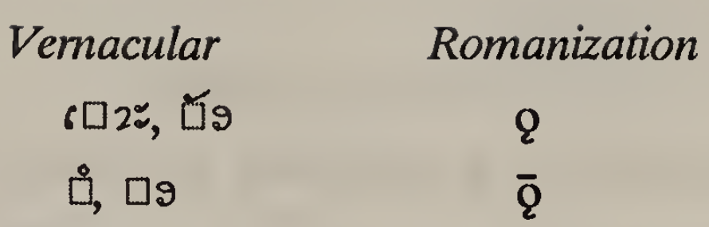
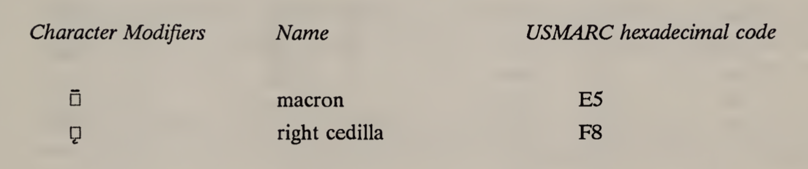
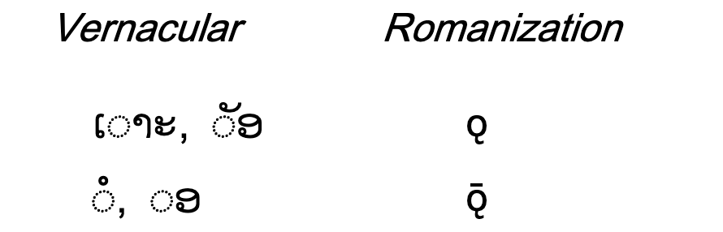

# Encoding issues in Thai and Lao romanisation

## Left half ring below vs ogonek

Recently, I have been spending more and more time working with Lao and Thai bibliographic records. While exploring the data, it became apparent that there were divergent cataloguing practices relating to the Thai and Lao vowels that were romanised using either ǫ (o with ogonek) or o̜ (o with combining Left Half Ring below):

<table>
<tr style="font-family: 'Bibliotheca LCG', 'Noto Sans'; font-size: 2.5em; text-align: center;">
    <td colspan="2">ǫ</td>
    <td colspan="2">ǭ</td>
    <td colspan="2">o̜</td>
    <td colspan="2">ō̜</td>
</tr>
<tr>
    <td>NFC</td>
    <td>NFD</td>
    <td>NFC</td>
    <td>NFD</td>
    <td>NFC</td>
    <td>NFD</td>
    <td>NFC</td>
    <td>NFD</td>
</tr>
<tr>
    <td>U+01EB</td>
    <td>U+006F U+0328</td>
    <td>U+01ED</td>
    <td>U+006F U+0328 U+0304</td>
    <td>U+006F U+031C</td>
    <td>U+006F U+031C</td>
    <td>U+014D U+031C</td>
    <td>U+006F U+031C U+0304</td>
</tr>
</table>

I was curious about the divergent practice. There is limited information published about the history of the ALA-LC Romanisation tables.

### 1997 romanisation tables

The relevant section of the 1997 romanisation table:

The table uses ǫ (LATIN SMALL LETTER O WITH OGONEK) and ǭ (LATIN SMALL LETTER O WITH OGONEK AND MACRON) for Lao romanisation.

The 1997 also includes a table giving the MARC-8 byte sequences of extended Latin characters and combining diacritics. The relevant selection is:

While the table uses `F1`, the MARC-8 special characters table indicates that `F8` should be used.

MARC-8 ANSEL `F8` (RIGHT CEDILLA) byte equates to the Unicode codepoint `031C` (COMBINING LEFT HALF RING BELOW), while the MARC-8 ANSEL byte `F1` (RIGHT HOOK, OGONEK) equates to Unicode codepoint `0328` (COMBINING OGONEK).

### 2012 romanisation tables

The relevant section of the 2012 romanisation table:

Likewise, the 2012 table uses ǫ (LATIN SMALL LETTER O WITH OGONEK) and ǭ (LATIN SMALL LETTER O WITH OGONEK AND MACRON) for Lao romanisation.

The MARC-8 information, was script out of the 2012 table, as it was with other existing romanisation tables, leaving cataloguers to infer character to be used from the glyph used in the table.

It appears that some cataloguers and institutions continue to use U+031C, while other cataloguers, based on the 2012 table, use U+0328.